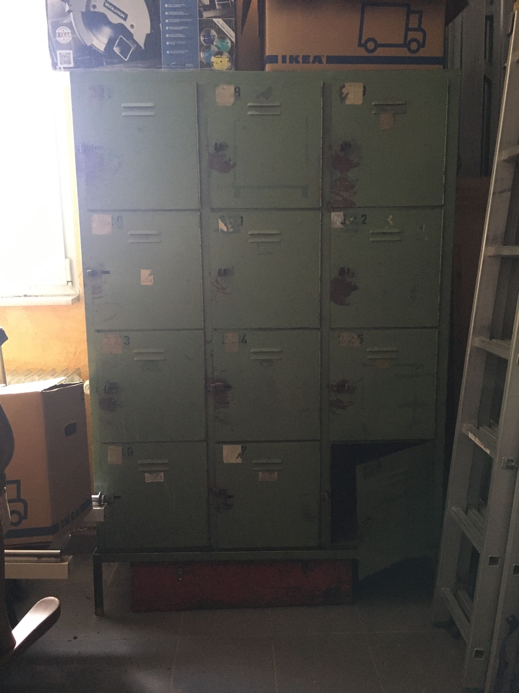

# ToolsLocker
Schrank mit 10 Türen für empfindliche/wertvolle Werkzeuge - Entnahme per Mitglieder RFID-Chip 
Geloggt wird UID2, TimeStamp Entnahme, Fachnummer(1 - 10), TimeStamp Rückgabe
  
Brain Storming:
- Schrank mit 10 Fächern. Geplant ist 2 Fächer mit doppelter Höhe einzurichten
  

- Verriegelung mechanisch (mit Hand zudrücken)
- Entriegelung elektromagnetisch (12V DC 2A Puls)

- single RFID-Lesegerät mit Display und 4x4 Tastatur
- XBee/ZBee Modul verbindet mit SYMCON

**Realisierungsvorschläge** 
[Zum Alpha Blockschaltbild](doc/ToolsLockerSchaltung_A0.pdf)