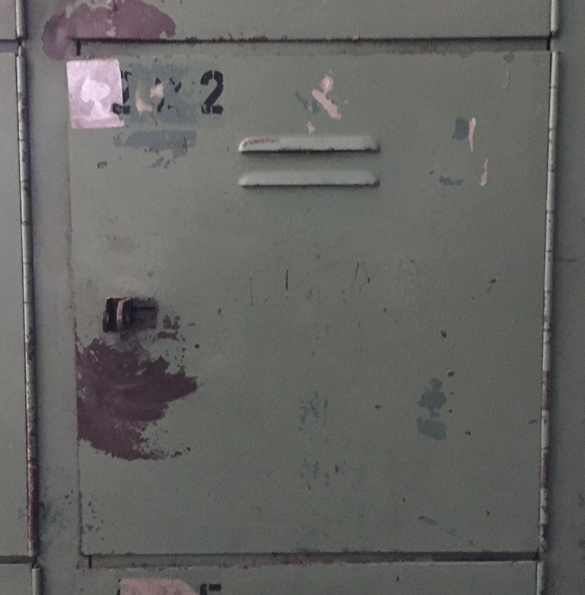
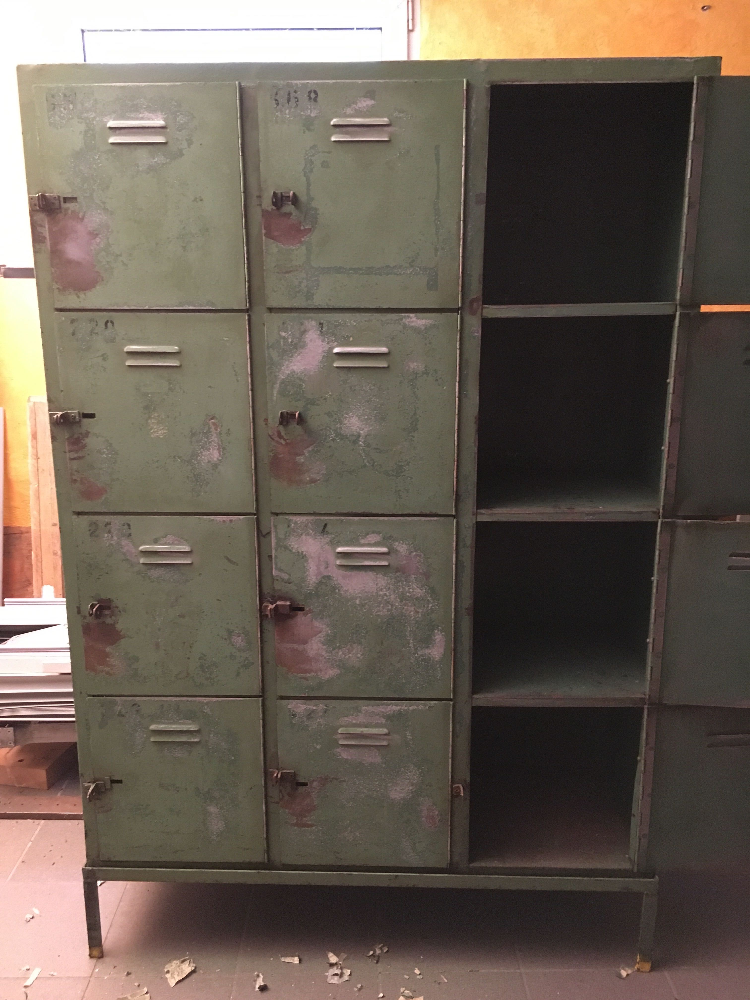
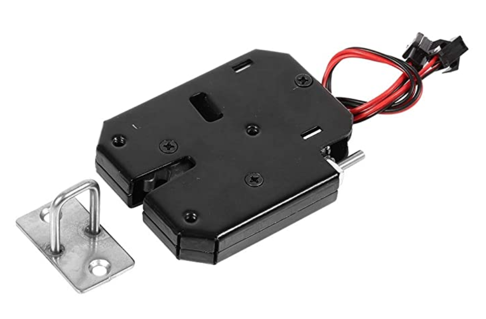
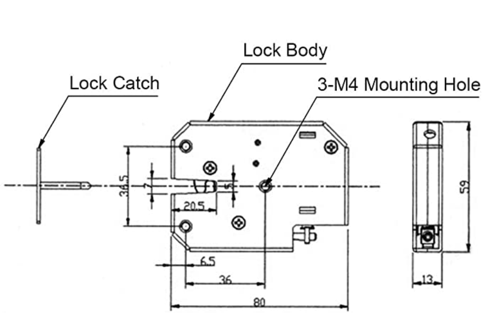

# ToolsLocker
Schrank mit 10 Türen für empfindliche/wertvolle Werkzeuge - Entnahme per Mitglieder RFID-Chip 
Geloggt wird UID2, TimeStamp Entnahme, Fachnummer(1 - 10), TimeStamp Rückgabe
  
Brain Storming:
- Schrank mit 10 Fächern. Geplant ist 2 Fächer mit doppelter Höhe einzurichten
  

- Verriegelung mechanisch (mit Hand zudrücken)
- Entriegelung elektromagnetisch (12V DC 2A Puls)

- single RFID-Lesegerät mit Display
- jede Tür hat einen Taster (zum öffnen) und eine LED
- XBee/ZBee Modul Funkbrücke zu SYMCON

 
<h1>Realisierungsvorschläge</h1>  

[Zum Projektschaltbild](doc/ToolsLock_Schaltung_B0.pdf) 

03.12.2020 - Es geht weiter mit dem ToolsLocker!

Erste Versuche waren bereits erfolgreich und Michael M. hat bereits den ersten Platinenentwurf für jeweils 4 Türen fertig gestellt.

Das Konzept sieht wie folgt aus:
- RFID-Leseeinheit mit Display - wie auch schon bei den anderen Maschinen
- 3 Interface Module die mit dem Controller über I2C-Bus kommunizieren
- jedes Interface Module kann 4 elektrische Schlösser und 4 Drucktaster mit LED-Indikator bedienen
- es gibt 2 Netzteile: 1 kleines für die Elektronik und ein Leistungsstarkes 12V Netzteil für die Türschlossmagneten
- der Prozessor kommuniziert über XBee ZBee mit unserem SYMCON-System, welches alle Überprüfungen machen wird, Freigaben erteilt und alle Vorgänge in einer Datenbank loggt

Hier die [System Blockschaltbilder](doc/ToolsLock_Schaltung_B0.pdf) 

Wen es interesseirt findet hier [das Schaltbild](doc//ToolsLockTreiberI2CML_SCH.PDF) der Interface Platine 

Hier schon mal eine Idee, wie die PCBs für den ToolsLocker aussehen werden:

Grober Funktionsablauf (Vorschlag):

