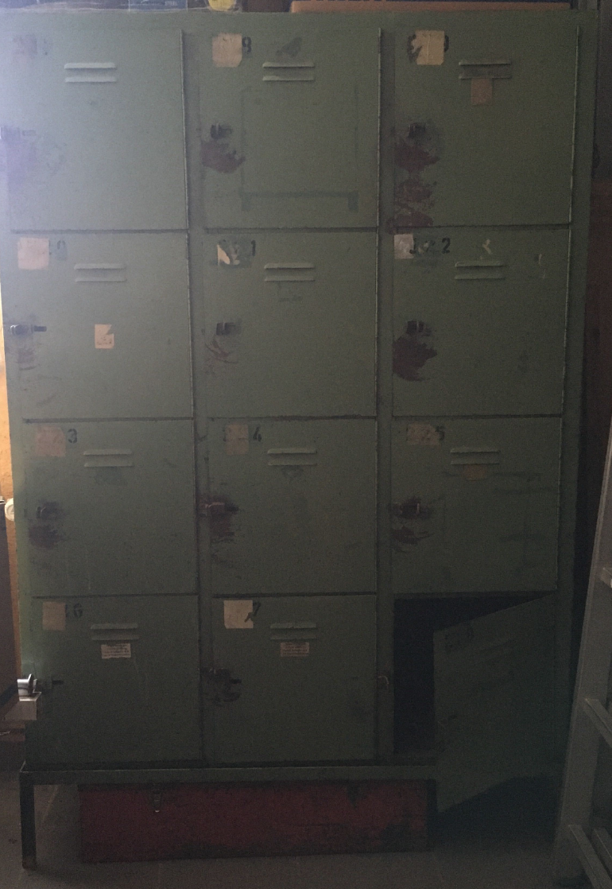

# ToolsLocker
Schrank mit 10 Türen für empfindliche/wertvolle Werkzeuge - Entnahme per Mitglieder RFID-Chip 
Geloggt wird UID2, TimeStamp Entnahme, Fachnummer(1 - 10), TimeStamp Rückgabe
  
Brain Storming:
- Schrank mit 10 Fächern. Geplant ist 2 Fächer mit doppelter Höhe einzurichten
  

- Verriegelung mechanisch (mit Hand zudrücken)
- Entriegelung elektromagnetisch (12V DC 2A Puls)

- single RFID-Lesegerät mit Display
- jede Tür hat einen Taster (zum öffnen) und eine LED
- XBee/ZBee Modul Funkbrücke zu SYMCON

 
<h1>Realisierungsvorschläge</h1>  

[Zum Alpha 0 Blockschaltbild](doc/ToolsLockerSchaltung_A0.pdf) 
[Zum Alpha 1 Schaltbild](doc/ToolsLockTreiberI2C_SCH.PDF) 
Es gibt bereits ein modifiziertes Schaltbild mit reduzierter Bauelementezahl
[Zum Alpha 2 Schaltbild](doc/ToolsLockTreiberI2CLight_SCH.PDF)